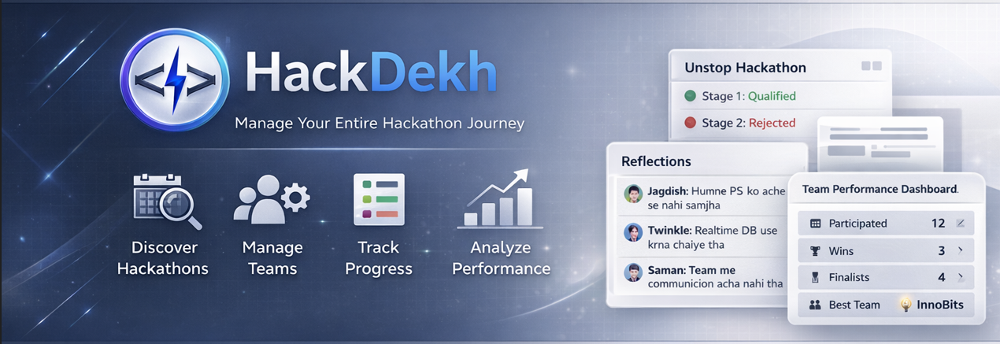

HackDekh is a platform that helps developers **discover hackathons and manage their entire participation workflow in one place**.
Instead of just listing hackathons, HackDekh focuses on helping teams **organize, track, and learn from every hackathon they participate in.**

## 🎯 MVP  Will be live soon! Stay Tuned...

---

<!-- ## ✨ Core features

**🔎 Hackathon Discovery**  
Aggregate open hackathons from platforms like Devfolio and Unstop in one searchable interface.

**👥 Team Management**  
Create and manage hackathon teams, track members, and organize participation.

**📍 Stage Tracking**  
Record each stage of a hackathon journey — applied, qualified, rejected, finalist, or winner.

**🧠 Reflection System**  
Capture team learnings after every hackathon to improve future performance.

**📊 Performance Dashboard**  
Track participation statistics, wins, finalists, and best-performing teams.

**🎯 Smart Listing Experience**  
Filter live opportunities, sort by deadline or prize, and surface urgent deadlines clearly.

**🎨 Clean Developer UI**  
Modern dark/light theme interface with polished cards, fallback media, and focused workflows.

---

## 🏗️ Tech Stack

- **Frontend**: React 19 + TypeScript + Vite + Tailwind CSS + React Router
- **UI / Motion**: Framer Motion + Lucide React
- **Backend**: Node.js + Express + TypeScript
- **Database**: MongoDB + Mongoose
- **Authentication**: JWT + bcrypt
- **Scraping**: Axios + Cheerio
- **Scheduler**: node-cron

---

## ⚙️ Environment Variables

Create a `.env` file inside `backend/` and configure the following values:

```env
PORT=3000
MONGO_URI=mongodb://localhost:27017
ACCESS_TOKEN_SECRET=your_access_token_secret
ACCESS_TOKEN_EXPIRY=1d
REFRESH_TOKEN_SECRET=your_refresh_token_secret
REFRESH_TOKEN_EXPIRY=7d
```

**📌 Note**  
The frontend currently targets `http://localhost:3000/api/v1`, so keeping the backend on `PORT=3000` is the easiest local setup.


## 🛠️ Local Development

```bash
# Terminal 1: start backend
cd backend
npm install
npm run dev

# Terminal 2: start frontend
cd frontend
npm install
npm run dev
```

---

## 📦 Useful Scripts

```bash
# Build backend
cd backend && npm run build

# Build frontend
cd frontend && npm run build

# Lint frontend
cd frontend && npm run lint
```

--- -->

## 🤝 Contributing

Pull requests, issues, and feedback are welcome if they improve product quality, developer workflow, or user experience.

---

## 📄 License

MIT License © 2026 HackDekh

---

> Made with 🩵 by *Jagdish Padhi* for all Hackathon Hunters.
