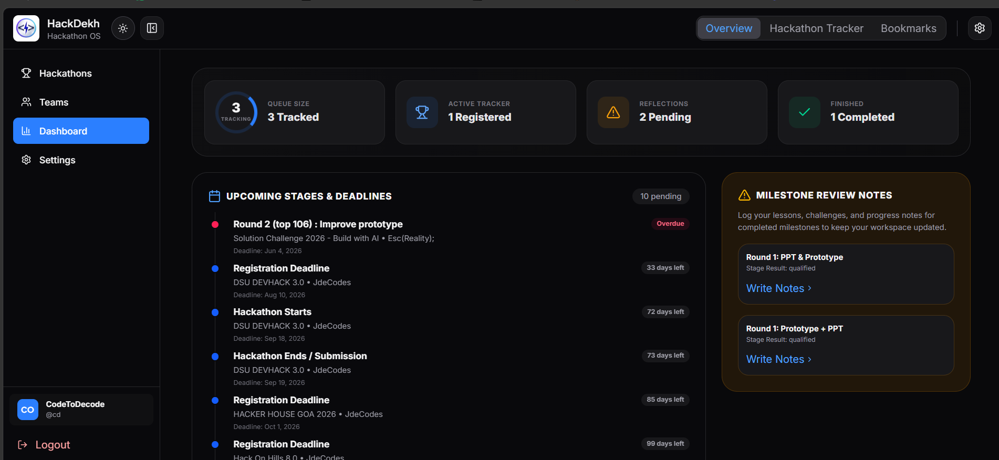
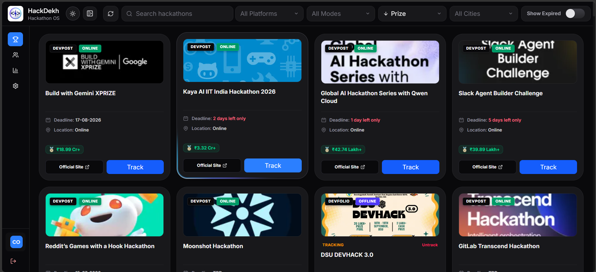
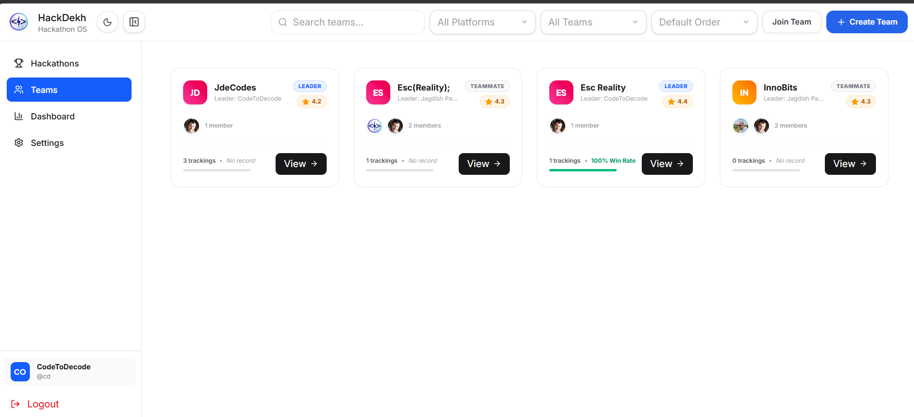
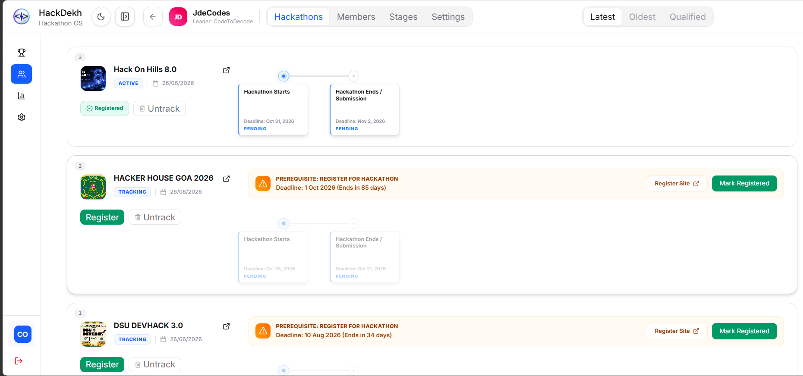

<div align="center">


## **The Core operating system for Hackathon lovers is [live now](https://hackdekh.jdecodes.tech/)!**

Discover hackathons across every major platform, organize your team, track your progress stage by stage, and turn every event into a lesson for the next one.

Many MORE things to come...Stay tuned!

<p>
  
  
  
  
  
</p>

[Features](#-features) • [Screenshots](#️-product-preview) • [Quick Start](#-quick-start) • [Contributing](#-contributing) • [License](#-license)

</div>

---

## 🧭 Overview

Hackathon teams rarely lose because of bad ideas. They lose because the process around the idea is scattered — listings on Devfolio, deadlines on Unstop, coordination on WhatsApp, and progress tracked nowhere at all.

HackDekh replaces that sprawl with a single workspace. It aggregates hackathons from multiple platforms, gives teams a shared space to organize around each event, and tracks every stage from application to result — with reflections captured along the way so every hackathon makes the next one easier to win.

---

## ⚡ Why HackDekh

Modern hackathon workflows are fragmented across tools that were never built to work together.

- **Discovery is scattered** — teams check five platforms instead of one feed
- **Coordination lives in chat** — team formation and roles get lost in group messages
- **Progress is untracked** — no shared view of what stage a team is actually in
- **Lessons disappear** — feedback from judges and retros vanish after the event ends

HackDekh centralizes all of it — discovery, teams, progress, and reflection — in one connected system.

---

## 🧩 Features

### 🔍 Hackathon Discovery
A unified feed aggregated from multiple hackathon platforms, so teams stop checking five tabs a day.

- Automated aggregation from Devfolio, Devpost, Unstop, MLH, and Hack2Skill
- Scheduled background refresh via cron, independent of user traffic
- Deadline, mode, prize, and tag metadata normalized into one schema
- Search and filtering across the full catalog

### 👥 Team Workspace
A dedicated space for teams to organize, independent of any single hackathon.

- Create teams and manage membership
- Invite by shareable join code, direct username lookup, or email link
- Accept or decline invitations from a personal inbox
- Reuse the same team across multiple hackathons

### 📊 Participation Tracking
A structured lifecycle for every team's run at a hackathon.

- Link a team to a hackathon and track status — tracking, active, finalist, won, eliminated
- Break participation into stages with deadlines and results
- Qualify, reject, or advance a stage as the event progresses
- Full history preserved per team, per hackathon

### 🪞 Reflection System
Structured retrospectives attached directly to the stage they came from.

- Capture what worked, what didn't, and judge feedback after each stage
- Pending reflection prompts surface automatically once a stage resolves
- Notes stay attached to that hackathon for future reference

### 📈 Personal Dashboard
A single view of a user's hackathon history and what's coming next.

- Saved and bookmarked hackathons
- Personal application tracker with status per hackathon
- Active teams and upcoming deadlines at a glance

### 🔐 Authentication
Session handling built for a multi-device, team-based product.

- Email and password auth with hashed credentials
- GitHub OAuth sign-in
- Access and refresh token rotation

---

## 🖼️ Product Preview

<div align="center">

**Dashboard**


**Hackathon Listing**



**Team Workspace**


**Stage & Reflection Tracking**


</div>

---

## 🛠️ Technology

**Frontend**
React 19 · TypeScript · Vite · Tailwind CSS · Framer Motion · Lucide Icons

**Backend**
Node.js · Express 5 · TypeScript · node-cron

**Database**
MongoDB · Mongoose

**Data Collection**
Axios · Cheerio (scraper layer with per-platform formatters)

**Auth & Delivery**
JWT · bcrypt · GitHub OAuth · Nodemailer

---

## 🚀 Quick Start

### Clone

```bash
git clone https://github.com/your-org/HackDekh.git
cd HackDekh
```

### Backend

```bash
cd backend
npm install
npm run dev
```

### Frontend

```bash
cd frontend
npm install
npm run dev
```

The frontend expects the backend to be reachable at the URL configured in `VITE_BACKEND_URL`.

---

## ⚙️ Environment Variables

### Backend — `backend/.env`

| Variable | Description |
|---|---|
| `PORT` | Port the API server listens on |
| `MONGO_URI` | MongoDB connection string |
| `ACCESS_TOKEN_SECRET` | Signing secret for short-lived access tokens |
| `ACCESS_TOKEN_EXPIRY` | Access token lifetime (e.g. `1d`) |
| `REFRESH_TOKEN_SECRET` | Signing secret for refresh tokens |
| `REFRESH_TOKEN_EXPIRY` | Refresh token lifetime (e.g. `7d`) |
| `GITHUB_CLIENT_ID` | GitHub OAuth application client ID |
| `GITHUB_CLIENT_SECRET` | GitHub OAuth application client secret |
| `SMTP_HOST` / `SMTP_PORT` / `SMTP_USER` / `SMTP_PASS` / `SMTP_FROM` | SMTP credentials for team invitation emails |
| `CRON_SECRET` | Shared secret required to trigger the scraper cron endpoint |

### Frontend — `frontend/.env.local`

| Variable | Description |
|---|---|
| `VITE_BACKEND_URL` | Base URL of the HackDekh API |
| `VITE_GITHUB_CLIENT_ID` | GitHub OAuth client ID used for sign-in |

---

## 📜 Scripts

### Backend

| Command | Description |
|---|---|
| `npm run dev` | Start the API in watch mode |
| `npm run build` | Compile TypeScript to `dist/` |
| `npm start` | Run the compiled build |

### Frontend

| Command | Description |
|---|---|
| `npm run dev` | Start the Vite dev server |
| `npm run build` | Type-check and build for production |
| `npm run lint` | Run ESLint across the codebase |
| `npm run preview` | Preview the production build locally |

---

## 🤝 Contributing

Contributions are welcome — bug fixes, scraper improvements, UI polish, and new features alike.

1. Fork the repository
2. Create a branch: `git checkout -b feature/my-feature`
3. Commit your changes
4. Push and open a pull request

---

## 📄 License

Distributed under the MIT License. See [`LICENSE`](LICENSE) for details.

---

<div align="center">

Built for developers who love hackathons.

</div>
