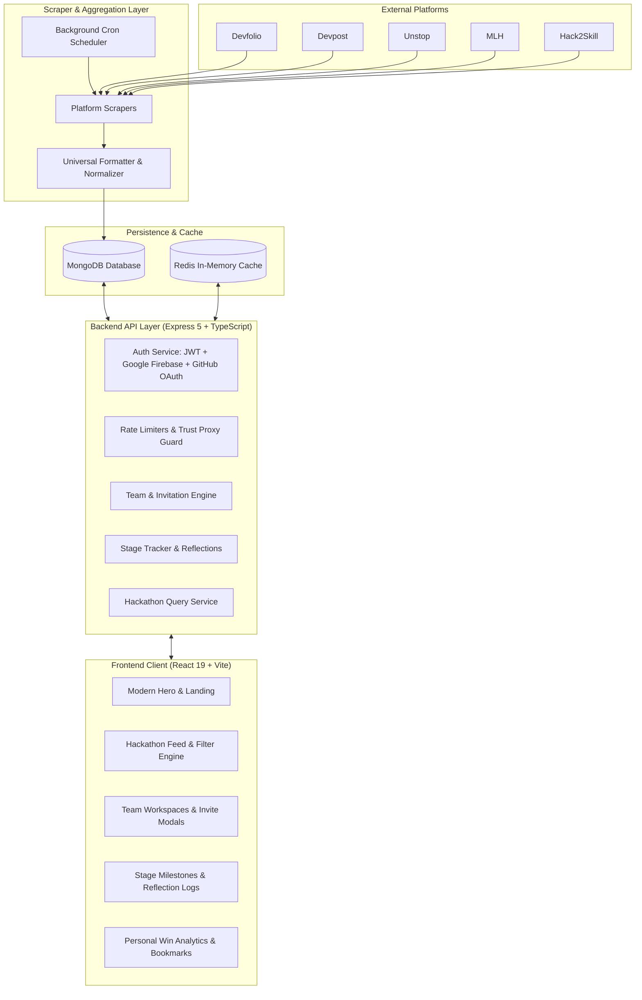
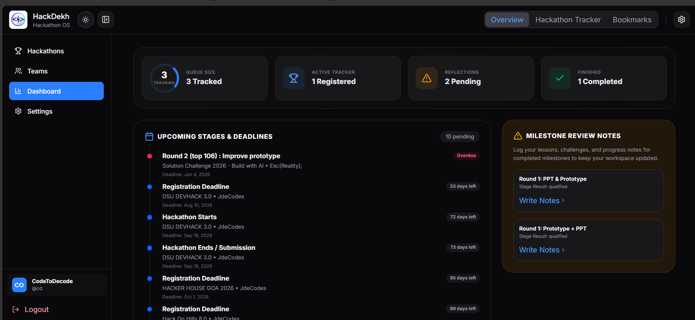
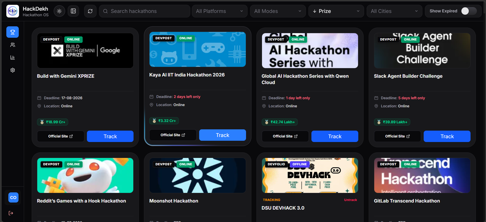
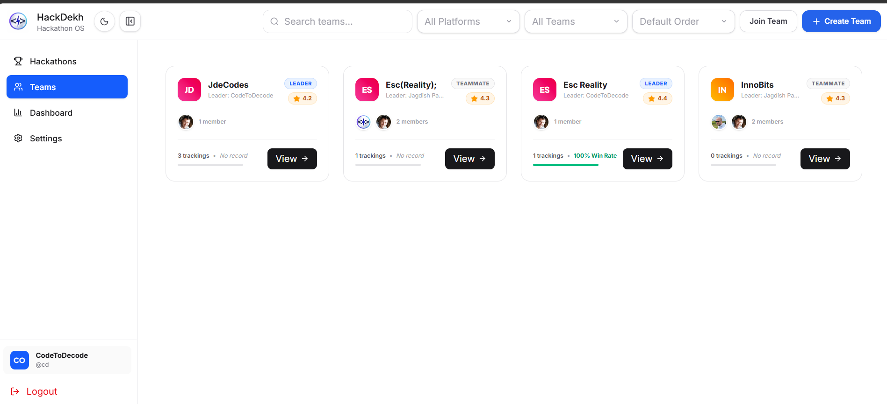
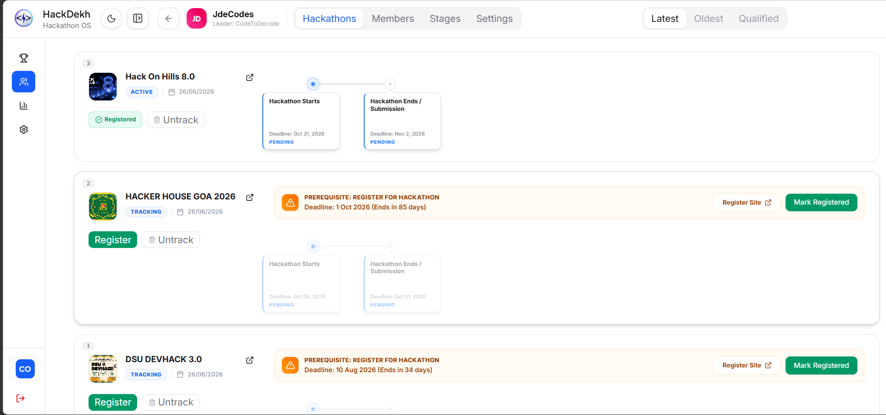

<div align="center">

  <a href="https://hackdekh.jdecodes.tech/">
    
  </a>

  <br />
  <br />

  <h1>Discover Faster. Build Better. Win Together.</h1>

  <p>
    <strong>The end-to-end workspace built for developers who love hackathons.</strong><br />
    Aggregate listings, organize your teams, track stage deadlines, and compound learnings into repeatable victories.
  </p>

  <p>
    <a href="https://hackdekh.jdecodes.tech/"><strong>Explore Live Platform »</strong></a>
  </p>

  <p>
    
    
    
    
    
    
  </p>

  <p>
    <a href="#-overview">Overview</a> •
    <a href="#-architecture">Architecture</a> •
    <a href="#-core-features">Features</a> •
    <a href="#-product-preview">Preview</a> •
    <a href="#-quick-start">Quick Start</a> •
    <a href="#-environment-variables">Configuration</a> •
    <a href="#-contributing">Contributing</a>
  </p>

</div>

---

## 🧭 Overview

Hackathon teams rarely lose because of bad ideas. They lose because the process around the build is messy — listings scattered across Devfolio and Devpost, deadlines slipping on Unstop, team coordination lost in chaotic WhatsApp groups, and judge feedback forgotten minutes after demo day.

**HackDekh replaces that chaos with one clean, unified workspace:**
- **Aggregate everything** — Live hackathon feeds automatically normalized from top platforms.
- **Form dedicated teams** — Instant roster management, invite codes, and magic links.
- **Stage-by-stage tracking** — Clear milestones from idea submission to demo day and finals.
- **Capture reflections** — Document judge questions, feedback, and learnings to build institutional memory.

---

## 🏗️ Architecture

HackDekh is engineered as a decoupled, production-ready stack with automated scraper pipelines, in-memory caching, rate-limited REST endpoints, and an interactive React frontend.


```mermaid
flowchart TD
    subgraph ExternalSources["External Platforms"]
        D1[Devfolio]
        D2[Devpost]
        D3[Unstop]
        D4[MLH]
        D5[Hack2Skill]
    end

    subgraph Ingestion["Scraper & Aggregation Layer"]
        CRON[Background Cron Scheduler] --> SCRAPERS[Platform Scrapers]
        D1 & D2 & D3 & D4 & D5 --> SCRAPERS
        SCRAPERS --> FORMAT[Universal Formatter & Normalizer]
    end

    subgraph DataStorage["Persistence & Cache"]
        FORMAT --> MONGODB[(MongoDB Database)]
        REDIS[(Redis In-Memory Cache)]
    end

    subgraph API["Backend API Layer (Express 5 + TypeScript)"]
        AUTH[Auth Service: JWT + Google Firebase + GitHub OAuth]
        RL[Rate Limiters & Trust Proxy Guard]
        TEAM_SVC[Team & Invitation Engine]
        TRACK_SVC[Stage Tracker & Reflections]
        HACK_SVC[Hackathon Query Service]
    end

    MONGODB <--> API
    REDIS <--> API

    subgraph Frontend["Frontend Client (React 19 + Vite)"]
        UI_HOME[Modern Hero & Landing]
        UI_EXPLORE[Hackathon Feed & Filter Engine]
        UI_TEAMS[Team Workspaces & Invite Modals]
        UI_TRACKER[Stage Milestones & Reflection Logs]
        UI_DASH[Personal Win Analytics & Bookmarks]
    end

    API <--> Frontend
```

---

## 🧩 Core Features

### 🔍 Unified Hackathon Feed
- Automatically pulls from Devfolio, Devpost, Unstop, MLH, and Hack2Skill.
- Background cron aggregation runs on an independent cadence without blocking incoming traffic.
- Real-time search, filters for online/in-person modes, upcoming deadlines, and prize pools.

### 👥 Team Workspaces
- Build distinct teams for different hackathons or collaborate with recurring teammates.
- Invite members instantly via shareable 6-character team codes, direct username lookup, or email magic links.
- Dedicated roster roles and team directories with zero chat clutter.

### 📊 Stage-by-Stage Milestone Tracker
- Break each hackathon campaign into structured stages: *Idea Phase*, *Shortlisted*, *Prototype Build*, *Demo Day*, and *Winner*.
- Transition statuses with real-time feedback and never miss a submission window again.

### 🪞 Judge Reflections & Team Knowledge
- Document judge queries, pitch feedback, and retrospective notes right after presentations.
- Turn every hackathon into compounding insights so future hackathons are easier to win.

### 🔐 Multi-Provider Authentication & Security
- Email and password sign-in with Brevo SMTP email verification.
- One-click Google Authentication (via Firebase Admin SDK) and GitHub OAuth.
- Strict rate limiting on authentication, join codes, verification emails, and scraper routes.

---

## 🖼️ Product Preview

<div align="center">

**Dashboard & Performance Analytics**


**Unified Hackathon Catalog & Filtering**


**Team Hub & Roster Management**


**Stage Milestones & Retrospectives**


</div>

---

## 🛠️ Technology Stack

| Domain | Technologies |
|:---|:---|
| **Frontend** | React 19, TypeScript, Vite, Tailwind CSS, Framer Motion, Lucide Icons |
| **Backend** | Node.js, Express 5, TypeScript, Node-cron |
| **Database & Cache** | MongoDB (Mongoose ODM), Redis |
| **Scraper Engine** | Axios, Cheerio, Custom Multi-Platform Normalizers |
| **Authentication & Email** | JWT, bcrypt, Firebase Admin (Google Auth), GitHub OAuth, Brevo SMTP |
| **Security & Quality** | Express Rate Limit (IP & route-level), Supertest, Vitest |

---

## 🚀 Quick Start

### 1. Clone Repository

```bash
git clone https://github.com/Jagdish-Padhi/HackDekh.git
cd HackDekh
```

### 2. Backend Setup

```bash
cd backend
npm install
cp .env.example .env    # Configure your database and auth credentials
npm run dev
```

### 3. Frontend Setup

```bash
cd ../frontend
npm install
cp .env.example .env.local    # Ensure VITE_BACKEND_URL points to your API
npm run dev
```

Visit `http://localhost:5173` to explore HackDekh locally.

---

## ⚙️ Environment Variables

### Backend — `backend/.env`

| Variable | Description |
|---|---|
| `PORT` | HTTP port for the Express server (default `8000`) |
| `MONGODB_URI` | MongoDB connection URI (`mongodb://127.0.0.1:27017/hackdekh`) |
| `ACCESS_TOKEN_SECRET` / `EXPIRY` | JWT access token secret and lifetime (e.g. `1d`) |
| `REFRESH_TOKEN_SECRET` / `EXPIRY` | JWT refresh token secret and lifetime (e.g. `10d`) |
| `REDIS_URL` | Redis instance URL (`redis://127.0.0.1:6379`) |
| `CACHE_ENABLED` | Toggle for in-memory cache layer (`true` / `false`) |
| `CRON_SECRET` | Secret key required to invoke protected scraper cron routes |
| `GITHUB_CLIENT_ID` / `SECRET` | GitHub OAuth application credentials |
| `FIREBASE_*` | Firebase project credentials for Google token verification |
| `SMTP_*` / `BREVO_API_KEY` | SMTP configuration for email verification & invite dispatch |

### Frontend — `frontend/.env.local`

| Variable | Description |
|---|---|
| `VITE_BACKEND_URL` | Base API endpoint (e.g. `http://localhost:8000/api/v1`) |
| `VITE_GITHUB_CLIENT_ID` | GitHub OAuth client ID for browser login |
| `VITE_FIREBASE_*` | Firebase web client config for one-tap Google authentication |

---

## 📜 Available Scripts

### Backend (`/backend`)
- `npm run dev`: Launch API with nodemon hot-reloading
- `npm run build`: Compile TypeScript into production bundle in `dist/`
- `npm test`: Run automated unit and integration tests with Vitest

### Frontend (`/frontend`)
- `npm run dev`: Start Vite development server
- `npm run build`: Run TypeScript validation and create minified production bundle
- `npm test`: Run component unit tests

---

## 🤝 Contributing

Contributions make the hackathon community stronger. Feedback, bug reports, and pull requests are warmly welcomed:

1. Fork the repo and create your branch (`git checkout -b feature/amazing-feature`)
2. Commit your changes (`git commit -m 'feat: add amazing feature'`)
3. Push to your branch (`git push origin feature/amazing-feature`)
4. Open a Pull Request on the `dev` branch

---

## 📄 License

Distributed under the **MIT License**. See [`LICENSE`](LICENSE) for complete terms.

---

<div align="center">
  <sub>Built with ❤️ by <a href="https://github.com/Jagdish-Padhi">Jagdish Padhi</a> for builders everywhere.</sub>
</div>
