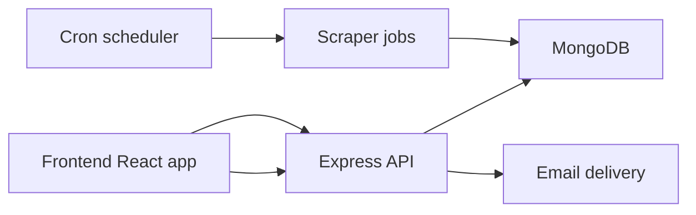

# Architecture

## Navigation

- [API](API.md)
- [Database](Database.md)
- [Deployment](Deployment.md)
- [Scraper System](Scraper-System.md)

## Overview

HackDekh is organized as a two-workspace TypeScript application:

- A React frontend for browsing hackathons and managing team workflows.
- An Express backend that serves the API, runs scraper jobs, and stores data in MongoDB.

The codebase is structured around a few core workflows:

1. Hackathon discovery through scraper-driven ingestion.
2. User authentication and personal tracking.
3. Team collaboration around hackathon participation.
4. Stage-by-stage progress tracking and reflections.

## System Map

## Repository Layers

| Layer | Responsibility | Representative files |
| --- | --- | --- |
| Frontend | UI, routing, protected pages, dashboard workflows | `frontend/src/App.tsx`, `frontend/src/components/MainLayout.tsx`, `frontend/src/pages/*` |
| API | Route registration, request handling, authentication, errors | `backend/src/app.ts`, `backend/src/index.ts`, `backend/src/routes/*` |
| Domain logic | Team, stage, reflection, and hackathon workflows | `backend/src/controllers/*`, `backend/src/services/*` |
| Data | MongoDB models and persistence rules | `backend/src/models/*`, `backend/src/db/connection.ts` |
| Ingestion | Scrapers and refresh orchestration | `backend/src/scrappers/*`, `backend/src/cron/*` |

## Frontend Structure

The frontend uses React Router for page-level navigation and a shared layout shell for authenticated and guest views.

Current public and protected routes include:

- Public: home, hackathons, hackathon detail pages, login, invitation acceptance, GitHub auth callback.
- Protected: teams, dashboard, tracker, settings.

The layout layer handles navigation chrome, responsive menus, and theme state, while the page layer owns the actual user workflows.

## Backend Structure

The backend is mounted under `/api/v1` and keeps responsibilities separated by route group:

- `/hackathons` for listing and detail retrieval.
- `/users` for authentication, saved hackathons, applications, and user lookup.
- `/teams` for team CRUD, invitations, hackathon participation, stages, and reflections.
- `/scrape` for source-specific scraper execution and refresh triggers.

The server also starts the nightly scraper scheduler during application boot.

## Data Flow

1. Scrapers normalize hackathon listings into MongoDB.
2. The frontend reads those listings through the hackathon API.
3. Authenticated users save hackathons, create teams, and link teams to hackathons.
4. Stage updates and reflections are stored against the team-hackathon relationship.

## Maintenance Notes

- Keep cross-cutting logic in the existing controller/service split.
- Prefer extending existing route groups instead of introducing parallel APIs.
- Treat the current scraper set as the supported ingestion surface unless the repository itself adds new sources.
