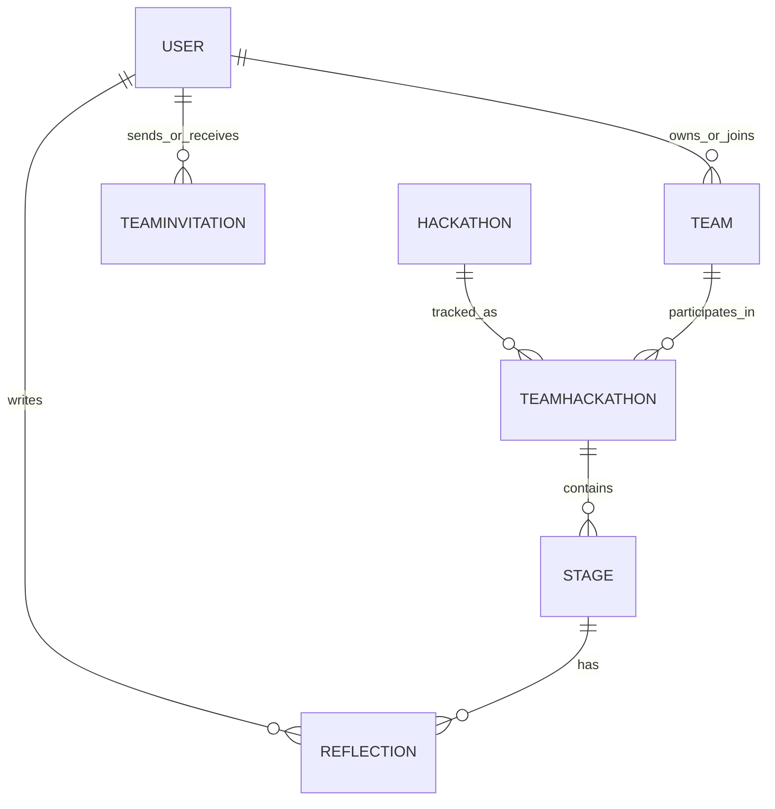

# Database

## Navigation

- [Architecture](Architecture.md)
- [API](API.md)
- [Deployment](Deployment.md)
- [Scraper System](Scraper-System.md)

## Overview

HackDekh uses MongoDB with Mongoose models. The database name is currently `hackdekh`.

## Collections

| Collection | Responsibility | Notes |
| --- | --- | --- |
| `users` | Authentication, profile data, saved hackathons, applications | Passwords are hashed before save; refresh tokens are stored on the user record |
| `teams` | Team metadata and membership | Stores the owner, member references, and join code |
| `hackathons` | Normalized hackathon listings | Indexed by slug/platform for deduplication |
| `teamhackathons` | Team participation in a hackathon | Stores status, stages, and the current stage reference |
| `stages` | Milestones inside a team participation | Tracks result, notes, and reflection state |
| `reflections` | Standalone reflection records | References a stage and a user |
| `teaminvitations` | Team invitation lifecycle | Includes token, status, expiration, and acceptance metadata |

## Entity Relationships

## Model Details

### User

- Username, email, and display name are indexed for lookups.
- Passwords are hashed with bcrypt in the model layer.
- Saved hackathons and application tracking are stored on the user document.

### Hackathon

- Stores normalized listing data from the scraper system.
- Includes title, slug, platform, mode, deadlines, tags, and related metadata.
- Uses a unique index on `slug + platform` to reduce duplicates.

### Team

- Stores the team name, owner, members, and invitation join code.
- The owner and member lists are references to users.

### TeamHackathon

- Represents a team participating in a hackathon.
- Stores the current status and the ordered list of stage references.
- Links one team to one hackathon.

### Stage

- Stores the milestone name, deadline, result, notes, and reflection state.
- Result values are limited to `pending`, `qualified`, and `rejected`.

### Reflection

- Stores one user’s reflection for one stage.
- Indexed by stage and user for lookups.

### TeamInvitation

- Stores invitation tokens, status, and expiry metadata.
- Uses TTL indexing so expired invitations are cleaned up automatically.

## Operational Notes

- The backend connects using `MONGO_URI` and appends the database name from the codebase constant.
- Data integrity relies on the existing schema indexes and the controller/service layer.
- Any new model should follow the same Mongoose style as the current files.
