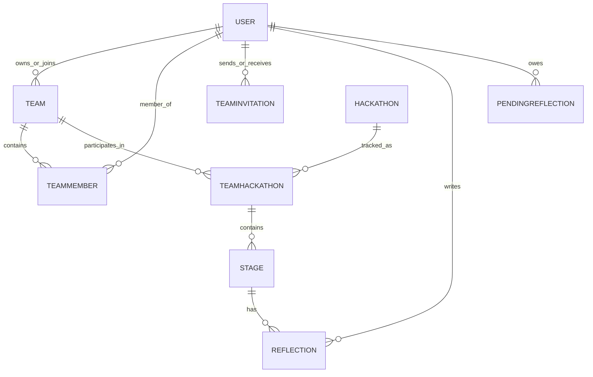

# Database

## Navigation

- [Architecture](Architecture.md)
- [API](API.md)
- [Deployment](Deployment.md)
- [Scraper System](Scraper-System.md)
- [DynamoDB AWS Migration](DynamoDB-Deployment.md)

## Overview

HackDekh uses **Amazon DynamoDB**. The schema is defined as plain TypeScript model wrappers in `backend/src/models/*` that issue `@aws-sdk/lib-dynamodb` commands directly (there is no ORM). Table names are prefixed with `DYNAMODB_TABLE_PREFIX` (default `hackdekh`), e.g. `hackdekh-users`.

Tables are created automatically at startup by `ensureTables()` in `backend/src/db/initTables.ts` (idempotent, `PAY_PER_REQUEST` billing). Local development uses DynamoDB Local via `docker-compose.yml`; production uses AWS DynamoDB — see [DynamoDB AWS Migration](DynamoDB-Deployment.md).

## Tables

| Table | Partition Key | Sort Key | Global Secondary Indexes | Notes |
| --- | --- | --- | --- | --- |
| `users` | `_id` | — | `email-index` (email), `username-index` (username) | Passwords are bcrypt-hashed before save; refresh tokens stored on the record |
| `hackathons` | `_id` | — | `slug-platform-index` (slug, platform) | Normalized scraper listings; deduplicated via `slug + platform` |
| `teams` | `_id` | — | `owner-index` (owner), `code-index` (code) | Team metadata, owner, member list, join code |
| `teammembers` | `userId` | `teamId` | — | Companion table mapping users to teams (one row per membership) |
| `teaminvitations` | `_id` | — | `token-index` (token), `team-index` (team), `email-status-index` (invitedEmail, status), `inviteduser-status-index` (invitedUser, status) | TTL on `expiresAt` auto-clears expired invitations |
| `teamhackathons` | `_id` | — | `team-index` (team, createdAt) | Links one team to one hackathon; stores status and stage references |
| `stages` | `_id` | — | `teamhackathon-index` (teamHackathon, createdAt) | Milestones inside a team participation; result, notes, reflection state |
| `pendingreflections` | `userId` | `stageId` | — | Companion table marking stages that still need a reflection |
| `reflections` | `_id` | — | `stage-index` (stage), `user-index` (user) | One user's reflection for one stage |

## Entity Relationships

```mermaid
erDiagram
  USER ||--o{ TEAM : owns_or_joins
  USER ||--o{ TEAMMEMBER : member_of
  TEAM ||--o{ TEAMMEMBER : contains
  USER ||--o{ TEAMINVITATION : sends_or_receives
  USER ||--o{ REFLECTION : writes
  USER ||--o{ PENDINGREFLECTION : owes
  HACKATHON ||--o{ TEAMHACKATHON : tracked_as
  TEAM ||--o{ TEAMHACKATHON : participates_in
  TEAMHACKATHON ||--o{ STAGE : contains
  STAGE ||--o{ REFLECTION : has
```

## Access Pattern Helpers

`backend/src/db/helpers.ts` provides the core data-access layer used by the models:

- CRUD: `dbGet`, `dbPut` (optional `ConditionExpression`), `dbUpdate` (builds `SET`/`REMOVE` expressions), `dbDelete`, `dbQuery`/`dbQueryAll` (auto-paginating), `dbScan`, `dbBatchGet`, `dbTransactWrite`/`dbTransactChunks`.
- Companion tables: `addTeamMember`/`removeTeamMember`/`listTeamMemberIds`, `setPendingReflection`/`clearPendingReflection`/`listPendingReflectionStageIds`.
- Helpers: `genId` (UUID), `nowISO`, `toISO`, `normalizeDates` (converts `Date` instances to ISO strings before write), `sanitizeUserDoc` (strips `password`/`refreshToken`).
- `populate()` in `backend/src/models/populate.ts` is the replacement for Mongoose `.populate()` — it `BatchGet`s referenced IDs (arrays or single strings) and replaces them with the fetched documents.

## Model Details

### User

- Username, email, and display name are looked up via GSIs (`email-index`, `username-index`).
- Passwords are hashed with bcrypt in the model layer.
- `email` and `username` uniqueness is enforced with GSI reads + a conditional `PutCommand`.
- Saved hackathons and application tracking are stored on the user record.

### Hackathon

- Stores normalized listing data from the scraper system.
- Uses `upsertHackathon({ slug, platform }, data)` — the entry point for every scraper.
- Deduplication uses the `slug-platform-index` GSI.
- `Date` values from formatters are normalized to ISO strings via `normalizeDates`.

### Team

- Stores the team name, owner, members, and invitation join code.
- Membership is mirrored in the `teammembers` companion table.
- Join-code uniqueness is enforced via the `code-index` GSI.

### TeamHackathon

- Represents a team participating in a hackathon.
- Stores the current status and the ordered list of stage references.
- Queried per team via the `team-index` GSI.

### Stage

- Stores the milestone name, deadline, result, notes, and reflection state.
- Result values are limited to `pending`, `qualified`, and `rejected`.
- Queried per participation via the `teamhackathon-index` GSI.

### Reflection

- Stores one user's reflection for one stage.
- Indexed by stage and user for lookups.

### TeamInvitation

- Stores invitation tokens, status, and expiry metadata.
- TTL on `expiresAt` auto-cleans expired invitations.
- `token` and `status` are reserved words in DynamoDB, so expressions escape them (`#token`, `#st`).
- Empty GSI key values (e.g. an email-only invitation with no `invitedUser`) are stripped before write so the item stays out of the `inviteduser-status-index` (sparse index).

## Operational Notes

- The backend connects using `AWS_REGION`, `AWS_ACCESS_KEY_ID`, `AWS_SECRET_ACCESS_KEY`, and optionally `DYNAMODB_ENDPOINT` (local only). Tables are auto-created on boot.
- Timestamps are stored as ISO-8601 strings. The `DYNAMODB_ENDPOINT` variable must be **omitted** when running against real AWS.
- Any new model should follow the same repository style: a `*Document` interface plus a model object wrapping the `@aws-sdk/lib-dynamodb` commands.